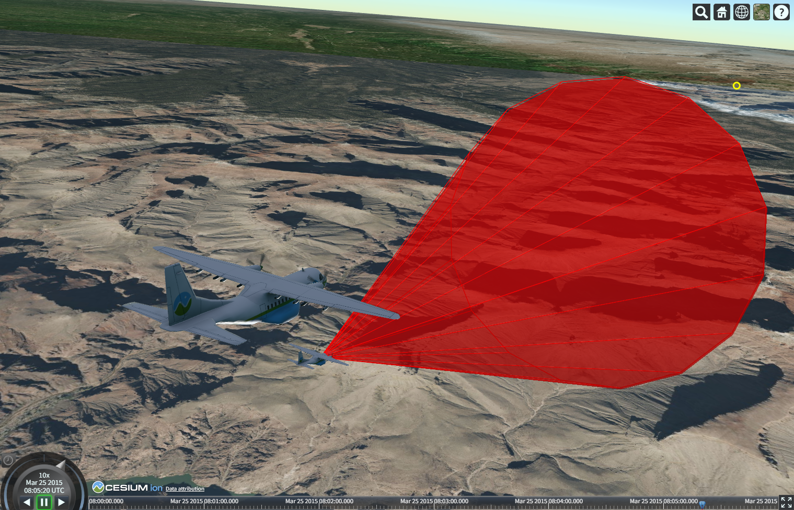

# Cesium 沙盒代码使用说明

## 一、准备工作
1. 打开 Cesium 沙盒网站：https://sandcastle.cesium.com/
2. 确保您的浏览器支持 WebGL 且网络连接稳定

## 二、复制代码
1. 在下方找到完整的代码块
2. 点击代码块右上角的复制按钮（或使用快捷键 Ctrl+C/Command+C）
```javascript
const viewer = new Cesium.Viewer("cesiumContainer", {
    infoBox: false,
    selectionIndicator: false,
    shadows: true,
    shouldAnimate: true,
});

const start = Cesium.JulianDate.fromDate(new Date(2015, 2, 25, 16));
const stop = Cesium.JulianDate.addSeconds(start, 360, new Cesium.JulianDate());

//Make sure viewer is at the desired time.
viewer.clock.startTime = start.clone();
viewer.clock.stopTime = stop.clone();
viewer.clock.currentTime = start.clone();
viewer.clock.clockRange = Cesium.ClockRange.LOOP_STOP; //Loop at the end
viewer.clock.multiplier = 10;
//Set timeline to simulation bounds
viewer.timeline.zoomTo(start, stop);

//Generate a random circular pattern with varying heights.
function computeCirclularFlight(lon, lat, radius) {
    const property = new Cesium.SampledPositionProperty();
    for (let i = 0; i <= 360; i += 45) {
        const radians = Cesium.Math.toRadians(i);
        const time = Cesium.JulianDate.addSeconds(start, i, new Cesium.JulianDate());
        const position = Cesium.Cartesian3.fromDegrees(
            lon + radius * 1.5 * Math.cos(radians),
            lat + radius * Math.sin(radians),
            Cesium.Math.nextRandomNumber() * 500 + 1750,
        );
        property.addSample(time, position);

        //Also create a point for each sample we generate.
        viewer.entities.add({
            position: position,
            point: {
                pixelSize: 8,
                color: Cesium.Color.TRANSPARENT,
                outlineColor: Cesium.Color.YELLOW,
                outlineWidth: 3,
            },
        });
    }
    return property;
}

//Compute the entity position property.
const position = computeCirclularFlight(-112.110693, 36.0994841, 0.03);


const availability = new Cesium.TimeIntervalCollection([
    new Cesium.TimeInterval({
        start: start,
        stop: stop,
    }),
])

const entity = viewer.entities.add({
    name: "父实体",
    position,
    orientation: new Cesium.VelocityOrientationProperty(position),
    availability: availability,
    model: {
        uri: "../SampleData/models/CesiumAir/Cesium_Air.glb",
        minimumPixelSize: 128,
        maximumScale: 20000,
    },
});

let heading = 0;

let pitch = 0;

let increasing = true;
function getHeading() {
    if (heading < 90 && increasing) {
        heading += 0.05;
        if (heading >= 90) {
            heading = 90;
            increasing = false;
        }
    } else {
        heading -= 0.05;
        if (heading <= -90) {
            heading = -90;
            increasing = true;
        }
    }

    return heading
}
let increasing1 = true;
function getPitch() {
    if (pitch < 45 && increasing1) {
        pitch += 0.05;
        if (pitch >= 45) {
            pitch = 45;
            increasing1 = false;
        }
    } else {
        pitch -= 0.05;
        if (pitch <= -45) {
            pitch = -45;
            increasing1 = true;
        }
    }

    return pitch
}
const entity_ = viewer.entities.add({
    name: "子实体",
    availability: availability,

    position: new Cesium.CallbackPositionProperty((t) => {
        // 获取当前时间的飞机的转换计算模型矩阵
        const airplaneMatrix = entity.computeModelMatrix(t);
        if (airplaneMatrix) {
            const payloadLocalOffset = new Cesium.Cartesian3(0, -5, -5); // 例如：飞机右侧5米，下方2米
            // 旋转之后的载荷坐标
            const payloadWorldPosition = Cesium.Matrix4.multiplyByPoint(
                airplaneMatrix,
                payloadLocalOffset,
                new Cesium.Cartesian3()
            );
            return payloadWorldPosition
        }
        return undefined;
    }, false),
    orientation: new Cesium.CallbackProperty((t) => {
        // 获取当前时间的飞机的转换计算模型矩阵
        const orientation_ = entity.orientation.getValue(t);
        if (orientation_) {
            // hpr 的旋转量，例如：X轴30度

            const localRotation = Cesium.Quaternion.fromHeadingPitchRoll(
                new Cesium.HeadingPitchRoll(
                    Cesium.Math.toRadians(getHeading()),
                    Cesium.Math.toRadians(getPitch()),
                    Cesium.Math.toRadians(0),
                )
            );
            // 基于父实体的旋转，做一次矩阵叠加运算
            const localRotationQuaternion = Cesium.Quaternion.multiply(orientation_, localRotation, new Cesium.Quaternion());
            return localRotationQuaternion;
        }
        return undefined;
    }, false),
    model: {
        uri: "../SampleData/models/CesiumAir/Cesium_Air.glb",
        // minimumPixelSize: 128,
        // maximumScale: 20000,
        scale: 0.25
    },
});

const height = 100

// 添加圆锥效果
const coneEntity = viewer.entities.add({
    name: "圆锥效果",
    availability: availability,

    position: new Cesium.CallbackPositionProperty((t) => {
        // 获取当前时间的飞机的转换计算模型矩阵
        const airplaneMatrix_cone = entity_.computeModelMatrix(t)
        if (airplaneMatrix_cone) {
            // 获取当前时间的飞机的转换计算模型矩阵

            const payloadLocalOffset_cone = new Cesium.Cartesian3(height / 2, 0, 0); // 例如：飞机右侧5米，下方2米
            // 旋转之后的载荷坐标
            const payloadWorldPosition_cone = Cesium.Matrix4.multiplyByPoint(
                airplaneMatrix_cone,
                payloadLocalOffset_cone,
                new Cesium.Cartesian3()
            );
            return payloadWorldPosition_cone
        }
        return undefined;
    }, false),
    orientation: new Cesium.CallbackProperty((t) => {
        // 获取当前时间的飞机的转换计算模型矩阵
        const orientation_cone = entity.orientation.getValue(t);
        if (orientation_cone) {

            // 获取当前实体的旋转四元数
            // hpr 的旋转量，例如：X轴30度
            const localRotation_cone = Cesium.Quaternion.fromHeadingPitchRoll(
                new Cesium.HeadingPitchRoll(
                    Cesium.Math.toRadians(getHeading()),

                    Cesium.Math.toRadians(90 + getPitch()),
                    Cesium.Math.toRadians(0),
                )
            );
            // 基于父实体的旋转，做一次矩阵叠加运算
            const localRotationQuaternion_cone = Cesium.Quaternion.multiply(orientation_cone, localRotation_cone, new Cesium.Quaternion());


            return localRotationQuaternion_cone;
        }
        return undefined;
    }, false),
    cylinder: {
        length: height, // 圆锥长度
        topRadius: 0, // 顶部半径为0，形成圆锥
        bottomRadius: height / 3, // 底部半径
        material: new Cesium.ColorMaterialProperty(
            Cesium.Color.RED.withAlpha(0.5) // 半透明红色
        ),
        slices: 16, // 圆锥的细分面数
        outline: true, // 显示轮廓线
        outlineColor: Cesium.Color.RED, // 轮廓线颜色
    }
});

viewer.trackedEntity = entity;
```

## 三、粘贴到沙盒
1. 在 Cesium 沙盒页面中，找到代码编辑区域（默认显示的是 main.js 文件内容）
2. 全选现有代码（Ctrl+A/Command+A）并删除
3. 粘贴您刚才复制的代码（Ctrl+V/Command+V）

## 四、运行查看效果
1. 点击沙盒页面左上角的"运行"按钮（三角形图标）

2. 等待加载完成，您将在右侧预览窗口中看到 Cesium 场景效果
3. 如果需要调整代码，可以直接在编辑区域修改后再次点击"运行"

## 五、常见问题
1. **无法加载地图**：检查网络连接，或尝试刷新页面
2. **代码报错**：确认复制的代码完整且没有遗漏任何符号
3. **效果不符合预期**：可能是您的代码中引用了外部资源，请确保相关资源可访问

## 六、注意事项
1. 本代码在 Cesium 最新稳定版本（1.95）上测试通过
2. 如果您的代码使用了特定的地形或影像服务，可能需要替换为您自己的服务地址
3. 沙盒中的代码不会自动保存，请自行备份重要代码片段

如有其他问题，请联系技术支持团队(ysuhan@yeah.net)。